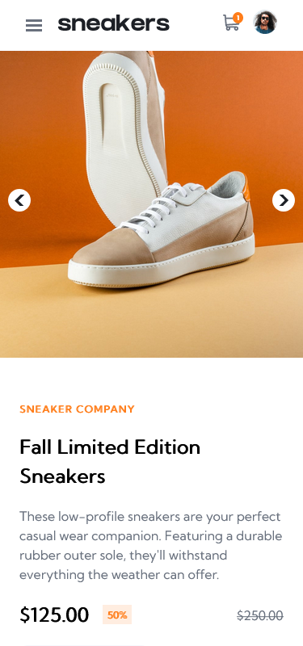
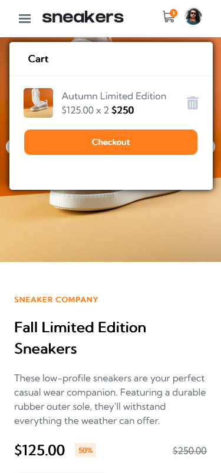
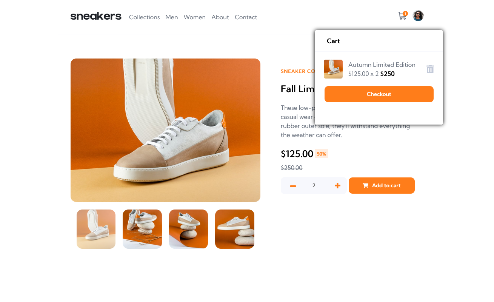

# Frontend Mentor - E-commerce product page
This is a solution to the [E-commerce product page challenge on Frontend Mentor](https://www.frontendmentor.io/challenges/ecommerce-product-page-UPsZ9MJp6).

## Table of contents

- [Overview](#overview)
  - [The challenge](#the-challenge)
  - [Screenshot](#screenshot)
    -[Mobile](#mobile-screen-shots)
    -[Mobile-2](#
  - [Links](#links)
- [My process](#my-process)
  - [Built with](#built-with)
  - [What I learned](#what-i-learned)
  - [Continued development](#continued-development)
  - [Useful resources](#useful-resources)

## Overview

### The challenge

Users should be able to:

- View the optimal layout for the site depending on their device's screen size
- See hover states for all interactive elements on the page
- Open a lightbox gallery by clicking on the large product image
- Switch the large product image by clicking on the small thumbnail images
- Add items to the cart
- View the cart and remove items from it

### Screenshot

####Mobile screen shots

####More mobile screen shots
Here is what the layout looks like when the 
menu activated

Desktop screen shots

## My process

### Built with

- HTML5 
- CSS3
- Flexbox
- CSS Grid
- Mobile-first workflow
- [Vue.js](https://nextjs.org/) - JS framework

### What I learned

This project has heled me learn about the basics of the vue framework. I have become more accustomed to data-binding with vue and working with modularized components.

### Continued development

Now that I am comfortable building reusable components with Vue, I can extent my knowledge to a larger e-commerce application with a fully fleshed out backend and state management like vuex.

